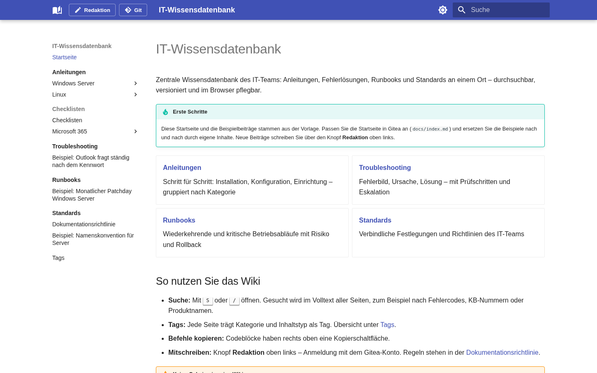
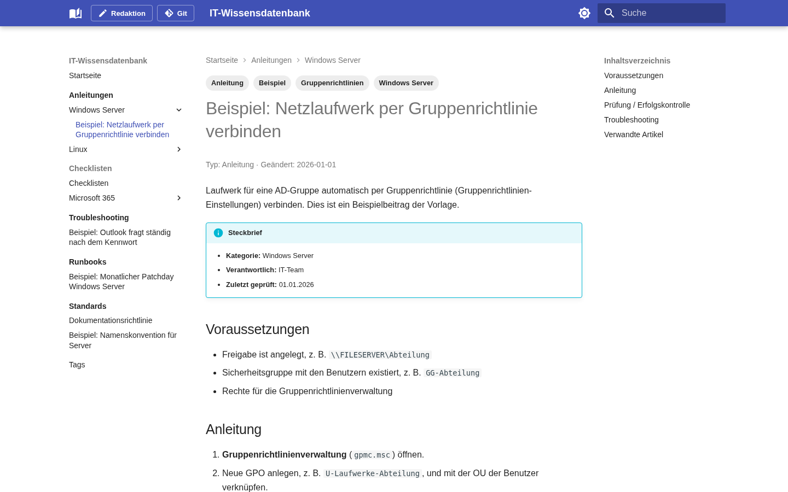
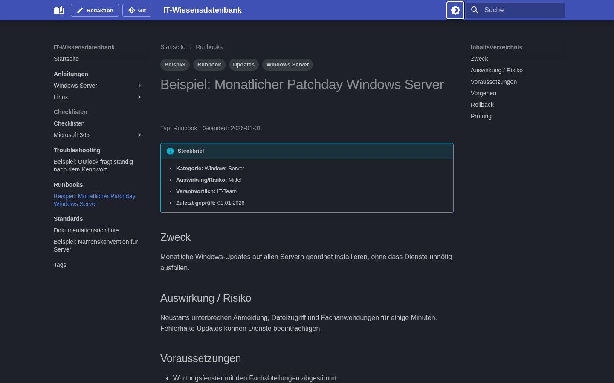
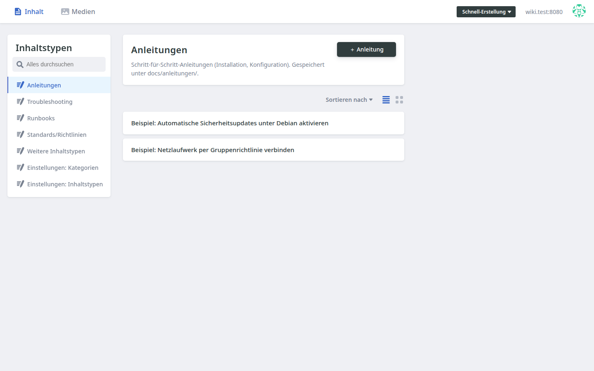
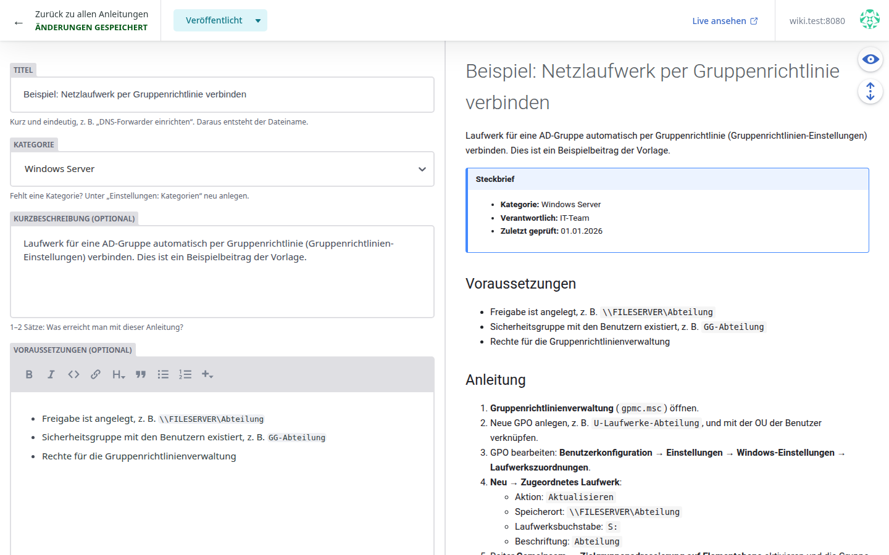
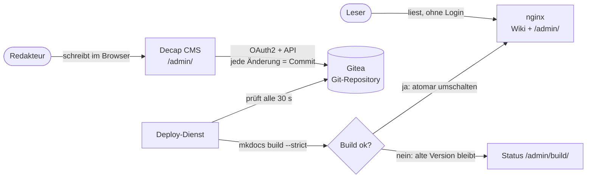

<div align="center">

# IT-Wiki

**Selbst gehostete IT-Wissensdatenbank mit Redaktion im Browser**

MkDocs Material · Decap CMS · Gitea · Docker – vollständig Open Source, ohne Cloud-Dienste

[](LICENSE)
[](https://squidfunk.github.io/mkdocs-material/)
[](https://decapcms.org/)
[](https://about.gitea.com/)
[](https://docs.docker.com/compose/)
[](#sicherheit)



</div>

---

Ein internes Wiki für IT-Teams: **Anleitungen, Troubleshooting, Runbooks und Standards** an einem Ort, durchsuchbar und versioniert. Leser brauchen keine Anmeldung. Redakteure schreiben im Browser über Formulare, ohne Markdown- oder Git-Kenntnisse. Jede Änderung ist ein Git-Commit, und veröffentlicht wird nur, was fehlerfrei baut.

Die Installation auf einer leeren Debian-VM erledigt ein einziges Skript, einschließlich Gitea, Anmeldung, Deploy-Dienst und Selbsttest.

> **English summary:** Self-hosted IT knowledge base (MkDocs Material) with a browser-based editor (Decap CMS) backed by a local Gitea instance. Every change is a Git commit; a deploy service rebuilds the site with `mkdocs build --strict` and only publishes successful builds. One script installs everything on a fresh Debian VM. UI and docs are in German.

## Inhalt

- [Funktionen](#funktionen)
- [Screenshots](#screenshots)
- [Architektur](#architektur)
- [Schnellstart](#schnellstart)
- [Konfiguration](#konfiguration)
- [Betrieb](#betrieb)
- [Projektstruktur](#projektstruktur)
- [Sicherheit](#sicherheit)
- [Dokumentation](#dokumentation)
- [Lizenz](#lizenz)

## Funktionen

**Für Leser**
- Modernes, schnelles Wiki mit Volltextsuche, Tags, hellem und dunklem Design
- Einheitlicher Aufbau je Beitrag: Steckbrief, Abschnitte, Screenshots mit Zoom, verwandte Artikel
- Läuft komplett offline und lädt keine externen Schriften oder Skripte

**Für Redakteure**
- Redaktion unter `/admin/`, Anmeldung mit dem Gitea-Konto
- Formulare für **Anleitung**, **Troubleshooting**, **Runbook** und **Standard** mit Live-Vorschau
- **Kategorien** und **eigene Inhaltstypen** (z. B. Checklisten) direkt in der Redaktion anlegen
- Bilder hochladen per Drag-and-drop
- Navigation, Übersichtslisten und Dateinamen entstehen automatisch
- Knöpfe „Redaktion“ und „Git“ oben links im Wiki

**Für Administratoren**
- Ein Skript für alles: `install`, `update`, `backup`, `adressen`, `editor`, `test`, `uninstall`
- Zugriff über IP oder eigene Domains hinter einem Reverse Proxy (z. B. Nginx Proxy Manager)
- Veröffentlichung nur nach erfolgreichem `mkdocs build --strict`, ein defekter Link blockiert das Deployment
- Atomare Releases mit Rollback, Build-Status unter `/admin/build/`
- Vollständiger Verlauf in Git, Löschen nur durch Administratoren

## Screenshots

| Beitrag mit Steckbrief | Dunkles Design |
|---|---|
|  |  |
| **Redaktion: Übersicht** | **Redaktion: Formular mit Live-Vorschau** |
|  |  |

## Architektur



| Dienst | Image | Port |
|---|---|---|
| Wiki (nginx) | `nginx:stable-alpine` | 8080 |
| Deploy-Dienst | eigenes Image (Python, MkDocs, Decap CMS 3.16) | – |
| Gitea | `gitea/gitea:1.27.3-rootless` (SQLite) | 3000 |

## Schnellstart

**Voraussetzungen:** Debian 12 oder 13, 2 GB RAM, 10 GB frei, Internetzugang während der Installation, Ports 8080 und 3000 frei.

```bash
# 1. Repository klonen (vollständig, ohne --depth)
sudo apt update && sudo apt install -y git
sudo git clone https://github.com/ben101111/it-wiki.git /opt/it-wiki
cd /opt/it-wiki

# 2. Docker, git, jq und curl installieren (falls nötig)
sudo bash scripts/cms-install.sh docker

# 3. Alles einrichten: Gitea, Admin, Repository, OAuth, Deploy-Dienst, Tests
sudo bash scripts/cms-install.sh install
```

Das Skript fragt nur nach:
1. der Server-IP (Bestätigung)
2. dem Zugriff: **IP** (`http://IP:8080`) oder **eigene Domains** (z. B. `wiki.firma.de` und `git.firma.de` mit HTTPS)
3. ob das Wiki **mit Beispielbeiträgen** oder **komplett leer** starten soll
4. Benutzername, E-Mail und Passwort des ersten Gitea-Administrators

Ohne Rückfragen zu Adressen und Beispielen:

```bash
sudo WIKI_URL=https://wiki.firma.de GITEA_URL=https://git.firma.de BEISPIELE=nein bash scripts/cms-install.sh install
```

Danach Redakteure anlegen. Beispielbeiträge lassen sich auch später noch entfernen:

```bash
sudo bash scripts/cms-install.sh editor vorname.nachname name@firma.de
sudo bash scripts/cms-install.sh beispiele
```

Eine Schritt-für-Schritt-Anleitung mit Reverse Proxy und typischen Fehlern steht in **[INSTALLATION-KURZ.md](INSTALLATION-KURZ.md)**.

### Mit Domains und Reverse Proxy

Die Redaktion läuft unter `/admin/` des Wikis und braucht keinen eigenen Proxy-Host:

| Domain | Ziel |
|---|---|
| `wiki.firma.de` | `http://SERVER-IP:8080` |
| `git.firma.de` | `http://SERVER-IP:3000` (`client_max_body_size 50m;`) |

Beide brauchen HTTPS. Für rein interne Domains eignet sich ein Let's-Encrypt-Zertifikat per DNS-Challenge (z. B. Cloudflare). Adressen lassen sich jederzeit umstellen:

```bash
sudo bash scripts/cms-install.sh adressen
```

## Konfiguration

Das Installationsskript erzeugt alle Werte selbst. Sie stehen in `/opt/it-wiki/.env` und `/opt/gitea/.env` (Rechte 600, nicht im Git):

| Variable | Bedeutung | Beispiel |
|---|---|---|
| `WIKI_URL` | öffentliche Adresse des Wikis | `https://wiki.firma.de` |
| `GITEA_URL` | öffentliche Adresse von Gitea | `https://git.firma.de` |
| `WIKI_PORT` | Port des Wikis auf dem Server | `8080` |
| `GITEA_REPO` | Repository mit den Inhalten | `it-team/it-wiki` |
| `OAUTH_CLIENT_ID` | OAuth-App für die Redaktion | wird erzeugt |
| `GITEA_DEPLOY_TOKEN` | Lese-Token des Deploy-Dienstes | wird erzeugt |
| `POLL_INTERVAL` | Prüfintervall in Sekunden | `30` |
| `KEEP_RELEASES` | aufbewahrte Releases für Rollback | `10` |
| `DECAP_HTTP_LOGIN` | Anmeldung ohne HTTPS erlauben | `true` bei IP, `false` bei HTTPS |
| `AUTH_BASIC` | zusätzlicher Passwortschutz fürs Lesen | `off` |

Name, Farben und Logo des Wikis stehen in `mkdocs.yml`. Kategorien und Inhaltstypen pflegen Sie in der Redaktion unter „Einstellungen“.

## Betrieb

```bash
cd /opt/it-wiki
sudo bash scripts/cms-install.sh status      # Zustand der Dienste
sudo bash scripts/cms-install.sh test        # automatische Abnahmetests
sudo bash scripts/cms-install.sh backup      # Vollbackup nach /opt/backups
sudo bash scripts/cms-install.sh editor NAME MAIL   # Redakteur anlegen
sudo bash scripts/cms-install.sh adressen    # IP <-> Domains umstellen
sudo bash scripts/cms-install.sh uninstall   # alles entfernen (vorher automatisches Backup)
sudo docker compose logs --tail 30 deployer  # Build-Protokoll
sudo docker compose exec deployer /usr/local/bin/deploy.py --force     # sofort neu bauen
sudo docker compose exec deployer /usr/local/bin/deploy.py --list      # Releases anzeigen
sudo docker compose exec deployer /usr/local/bin/deploy.py --rollback RELEASE  # zurückschalten
```

**Update auf eine neue Version.** Die Inhalte aus der Redaktion bleiben dabei erhalten:

```bash
rm -rf ~/it-wiki-neu && git clone --depth 1 https://github.com/ben101111/it-wiki.git ~/it-wiki-neu
sudo bash ~/it-wiki-neu/scripts/cms-install.sh update
```

## Projektstruktur

```text
it-wiki/
├── admin/                  Redaktion (Decap CMS): Oberfläche, Formulare, Vorschau
├── cms/                    Kategorien und Inhaltstypen (in der Redaktion gepflegt)
├── docker/
│   ├── default.conf.template   nginx-Konfiguration
│   └── deployer/           Deploy-Dienst (Dockerfile, deploy.py)
├── docs/                   Wiki-Inhalte (Markdown) inkl. Beispielbeiträgen
├── gitea/                  Docker-Compose für Gitea
├── hooks/wiki_cms.py       MkDocs-Hook: Navigation, Formular-Darstellung, Listen
├── overrides/main.html     Theme-Erweiterung (Seiteninfo, Kopfzeilen-Knöpfe)
├── scripts/cms-install.sh  Installation und Betrieb
├── docker-compose.yml      Wiki + Deploy-Dienst
├── Dockerfile              Notfallvariante: Wiki ohne Redaktion
├── mkdocs.yml              Wiki-Konfiguration
├── HANDBUCH.md             ausführliche Betriebsanleitung
└── INSTALLATION-KURZ.md    Kurzanleitung
```

## Sicherheit

- **Alles lokal:** Es werden keine Cloud-Dienste und keine externen Git-Hoster genutzt. Gitea läuft auf demselben Server.
- **Lesen ist offen, Schreiben nur mit Gitea-Konto:** Die öffentliche Registrierung ist abgeschaltet, das Repository privat, Gitea verlangt eine Anmeldung.
- **Keine Geheimnisse im Git:** `.env`-Dateien haben die Rechte 600 und sind per `.gitignore` ausgeschlossen. Das Skript prüft das beim Import ins Gitea.
- **Minimale Rechte:** Gitea läuft rootless, der Deploy-Dienst ohne Linux-Capabilities und nur mit Lese-Token. Es gibt keinen Docker-Socket-Mount.
- **Geprüfte Abhängigkeiten:** Decap CMS ist auf eine Version mit SHA-256-Prüfsumme festgelegt.
- **HTTPS empfohlen:** Über HTTP funktioniert die Redaktion im internen Netz auch, sie wird dafür gezielt freigeschaltet. Für den Dauerbetrieb ist ein Reverse Proxy mit HTTPS sinnvoll.

> Das Wiki ist für den **internen** Einsatz gedacht. Lesen braucht keine Anmeldung, deshalb sollte es nicht ungeschützt im Internet erreichbar sein. Andernfalls schränken Sie den Zugriff im Reverse Proxy ein (Access List) oder aktivieren den Passwortschutz über `AUTH_BASIC` (siehe Handbuch).

Sicherheitslücken bitte nicht als öffentliches Issue melden, siehe [SECURITY.md](SECURITY.md).

## Dokumentation

| Dokument | Inhalt |
|---|---|
| [INSTALLATION-KURZ.md](INSTALLATION-KURZ.md) | Installation in 5 Schritten, Alltag, typische Fehler |
| [Kurzanleitung Installation](https://www.youtube.com/watch?v=Qlz0Q0Ejy9o) | Installation ohne Domain |
| [HANDBUCH.md](HANDBUCH.md) | Architektur, Backup und Restore, Benutzerverwaltung, Redaktion, Fehlerdiagnose, Updates |
| [CHANGELOG.md](CHANGELOG.md) | Änderungen je Version |
| [CONTRIBUTING.md](CONTRIBUTING.md) | Mitwirken |

## Lizenz

[MIT](LICENSE). Verwendete Projekte und ihre Lizenzen:
- [MkDocs](https://www.mkdocs.org/) (BSD-2-Clause)
- [Material for MkDocs](https://squidfunk.github.io/mkdocs-material/) (MIT)
- [Decap CMS](https://decapcms.org/) (MIT)
- [Gitea](https://about.gitea.com/) (MIT)
- [nginx](https://nginx.org/) (BSD-2-Clause)
